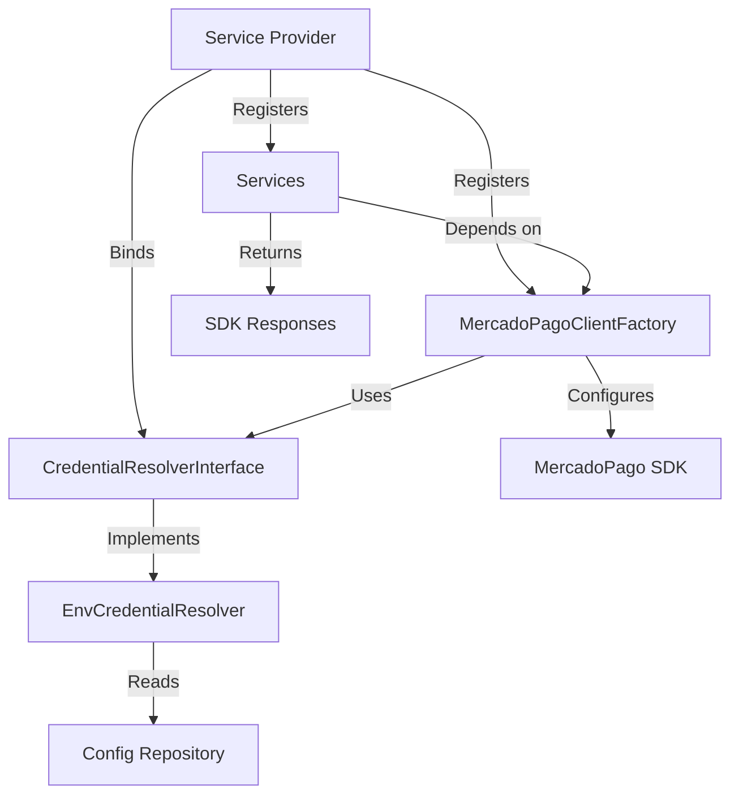

# Package Architecture

Laravel MercadoPago is built with clean architecture principles, leveraging Laravel's service container, dependency injection, and auto-discovery to provide a maintainable and testable integration with Mercado Pago.

## Architectural Overview

The package follows a layered architecture that separates concerns and promotes code reusability:

<CardGroup cols={2}>
  <Card title="Service Layer" icon="cube">
    Dedicated service classes for each Mercado Pago resource
  </Card>
  <Card title="Support Layer" icon="wrench">
    Factory and helper classes for SDK client management
  </Card>
  <Card title="Contract Layer" icon="file-contract">
    Interfaces for extensibility and testing
  </Card>
  <Card title="DTO Layer" icon="database">
    Data Transfer Objects for type-safe credential handling
  </Card>
</CardGroup>

## Core Components

### Service Provider

The `LaravelMercadoPagoServiceProvider` is the entry point for package registration and bootstrapping.

**Location**: `src/LaravelMercadoPagoServiceProvider.php:23`

```php
final class LaravelMercadoPagoServiceProvider extends ServiceProvider
{
    public function register(): void
    {
        // Merge package configuration
        $this->mergeConfigFrom(__DIR__ . '/../config/mercadopago.php', 'mercadopago');

        // Bind credential resolver
        $this->app->bind(CredentialResolverInterface::class, EnvCredentialResolver::class);
        
        // Register singletons
        $this->app->singleton(MercadoPagoClientFactory::class);
        $this->app->singleton(SdkHttpClient::class);
        $this->app->singleton(PreferenceService::class);
        $this->app->singleton(PaymentService::class);
        // ... other services
    }

    public function boot(Router $router): void
    {
        // Publish configuration
        $this->publishes([
            __DIR__ . '/../config/mercadopago.php' => config_path('mercadopago.php'),
        ], 'mercadopago-config');

        // Register middleware and routes
        $router->aliasMiddleware('mercadopago.demo', EnsureDemoRoutesEnabled::class);
        $this->loadRoutesFrom(__DIR__ . '/../routes/api.php');
    }
}
```

### Auto-Discovery

The package leverages Laravel's package auto-discovery feature. When you install the package via Composer, Laravel automatically:

1. Detects the service provider in `composer.json`
2. Registers the service provider on application boot
3. Binds all services to the container
4. Loads package routes and middleware

<Note>
No manual provider registration is needed. The package is ready to use immediately after installation.
</Note>

### Dependency Injection

All services are registered as singletons in Laravel's service container, enabling clean dependency injection:

```php
use Fitodac\LaravelMercadoPago\Services\PreferenceService;

class CheckoutController extends Controller
{
    public function __construct(
        private PreferenceService $preferenceService
    ) {}

    public function create()
    {
        $preference = $this->preferenceService->create([
            'items' => [/* ... */]
        ]);
    }
}
```

**Benefits of singleton registration:**

- Services are instantiated once per request lifecycle
- Reduced memory footprint and initialization overhead
- Shared SDK configuration across all services
- Consistent credential resolution

## Component Relationships

Here's how the major components interact:



### Service Layer

Each service encapsulates operations for a specific Mercado Pago resource:

- **PreferenceService** - Payment preferences (`src/Services/PreferenceService.php:9`)
- **PaymentService** - Payment processing (`src/Services/PaymentService.php:9`)
- **CustomerService** - Customer management (`src/Services/CustomerService.php:9`)
- **CardService** - Customer cards (`src/Services/CardService.php:9`)
- **RefundService** - Refund operations (`src/Services/RefundService.php:9`)
- **PaymentMethodService** - Payment methods (`src/Services/PaymentMethodService.php:9`)
- **WebhookService** - Webhook validation (`src/Services/WebhookService.php:13`)
- **TestUserService** - Test user creation (`src/Services/TestUserService.php:9`)

### Support Layer

#### MercadoPagoClientFactory

The factory handles SDK client instantiation and configuration.

**Location**: `src/Support/MercadoPagoClientFactory.php:11`

**Key responsibilities:**

1. **SDK Configuration** - Configures the Mercado Pago SDK with access tokens
2. **Client Resolution** - Dynamically instantiates SDK client classes
3. **Method Compatibility** - Handles SDK version differences
4. **Runtime Environment** - Sets appropriate environment (local/server)

```php
public function makeFirstAvailable(array $clientClasses): object
{
    $this->configureSdk();

    foreach ($clientClasses as $clientClass) {
        if (class_exists($clientClass)) {
            return new $clientClass();
        }
    }

    throw MercadoPagoConfigurationException::clientClassNotFound($clientClasses);
}
```

<Accordion title="Why use makeFirstAvailable?">
The Mercado Pago SDK occasionally changes class names between versions. The `makeFirstAvailable` method allows the package to support multiple SDK versions by attempting to instantiate clients from an array of possible class names.

This ensures backward and forward compatibility without requiring package updates for every SDK change.
</Accordion>

#### SdkHttpClient

Provides low-level HTTP access to Mercado Pago's API for endpoints not covered by the SDK.

**Location**: `src/Support/SdkHttpClient.php:11`

**Used by**: TestUserService for creating test users via direct API calls

```php
public function post(string $uri, array $payload): array
{
    $this->clientFactory->makeFirstAvailable([
        'MercadoPago\\Client\\Payment\\PaymentClient',
    ]);

    $client = new class (\MercadoPago\MercadoPagoConfig::getHttpClient()) 
        extends MercadoPagoClient 
    {
        public function postJson(string $uri, array $payload): MPResponse
        {
            return $this->send($uri, HttpMethod::POST, json_encode($payload));
        }
    };

    return $client->postJson($uri, $payload)->getContent();
}
```

### Contract Layer

#### CredentialResolverInterface

Defines the contract for credential resolution, enabling custom implementations.

**Location**: `src/Contracts/CredentialResolverInterface.php:9`

```php
interface CredentialResolverInterface
{
    public function resolve(): MercadoPagoCredentials;
}
```

The default implementation (`EnvCredentialResolver`) reads from Laravel's configuration, but you can bind your own resolver for:

- Database-backed credentials
- Multi-tenant configurations
- Vault or secrets manager integration
- Per-user credential resolution

### DTO Layer

#### MercadoPagoCredentials

A readonly Data Transfer Object for type-safe credential handling.

**Location**: `src/DTO/MercadoPagoCredentials.php:7`

```php
final readonly class MercadoPagoCredentials
{
    public function __construct(
        public string $accessToken,
        public ?string $publicKey = null,
        public ?string $webhookSecret = null,
    ) {}
}
```

## Configuration Management

The package uses a single configuration file that merges with Laravel's config system:

**Location**: `config/mercadopago.php:5`

```php
return [
    'access_token' => env('MERCADOPAGO_ACCESS_TOKEN'),
    'public_key' => env('MERCADOPAGO_PUBLIC_KEY'),
    'webhook_secret' => env('MERCADOPAGO_WEBHOOK_SECRET'),
    'route_prefix' => env('MERCADOPAGO_ROUTE_PREFIX', 'api/mercadopago'),
    'enable_demo_routes' => (bool) env('MERCADOPAGO_ENABLE_DEMO_ROUTES', true),
    'runtime_environment' => env('MERCADOPAGO_RUNTIME_ENVIRONMENT'),
];
```

<Warning>
Always publish the configuration file in production environments to customize settings:

```bash
php artisan vendor:publish --tag=mercadopago-config
```
</Warning>

## Exception Handling

The package defines custom exceptions for better error handling:

### MercadoPagoConfigurationException

**Location**: `src/Exceptions/MercadoPagoConfigurationException.php:9`

Thrown when:
- Access token is missing (`src/Exceptions/MercadoPagoConfigurationException.php:11`)
- SDK is not installed (`src/Exceptions/MercadoPagoConfigurationException.php:16`)
- Client class not found (`src/Exceptions/MercadoPagoConfigurationException.php:21`)
- Client method not found (`src/Exceptions/MercadoPagoConfigurationException.php:31`)

### InvalidWebhookSignatureException

**Location**: `src/Exceptions/InvalidWebhookSignatureException.php:9`

Thrown when:
- Webhook signature header is malformed (`src/Exceptions/InvalidWebhookSignatureException.php:11`)
- HMAC signature validation fails (`src/Exceptions/InvalidWebhookSignatureException.php:16`)

## Design Principles

### 1. Single Responsibility

Each service class handles exactly one Mercado Pago resource type:

- PreferenceService only manages preferences
- PaymentService only manages payments
- WebhookService only validates webhooks

### 2. Dependency Inversion

Services depend on abstractions (`CredentialResolverInterface`) rather than concrete implementations, making the package extensible and testable.

### 3. Open/Closed Principle

The package is open for extension (implement custom credential resolvers) but closed for modification (core services don't need changes).

### 4. Interface Segregation

The `CredentialResolverInterface` contains only one method, ensuring implementing classes aren't forced to implement unused methods.

## Extending the Package

You can extend the package behavior in several ways:

### Custom Credential Resolver

```php
namespace App\Services;

use Fitodac\LaravelMercadoPago\Contracts\CredentialResolverInterface;
use Fitodac\LaravelMercadoPago\DTO\MercadoPagoCredentials;

class DatabaseCredentialResolver implements CredentialResolverInterface
{
    public function resolve(): MercadoPagoCredentials
    {
        $credentials = \DB::table('payment_credentials')
            ->where('provider', 'mercadopago')
            ->first();

        return new MercadoPagoCredentials(
            accessToken: $credentials->access_token,
            publicKey: $credentials->public_key,
            webhookSecret: $credentials->webhook_secret,
        );
    }
}
```

Bind in `AppServiceProvider`:

```php
use Fitodac\LaravelMercadoPago\Contracts\CredentialResolverInterface;
use App\Services\DatabaseCredentialResolver;

public function register()
{
    $this->app->bind(
        CredentialResolverInterface::class, 
        DatabaseCredentialResolver::class
    );
}
```

### Service Decoration

```php
namespace App\Services;

use Fitodac\LaravelMercadoPago\Services\PaymentService;

class LoggingPaymentService extends PaymentService
{
    public function create(array $payload): mixed
    {
        \Log::info('Creating payment', ['payload' => $payload]);
        
        $result = parent::create($payload);
        
        \Log::info('Payment created', ['result' => $result]);
        
        return $result;
    }
}
```

## Next Steps

<CardGroup cols={2}>
  <Card title="Services" icon="cube" href="/concepts/services">
    Explore all available services and their methods
  </Card>
  <Card title="Credentials" icon="key" href="/concepts/credentials">
    Learn about credential management and security
  </Card>
  <Card title="API Reference" icon="book" href="/api/preference-service">
    View detailed API documentation for each service
  </Card>
  <Card title="Testing" icon="flask" href="/guides/testing">
    Learn how to test your Mercado Pago integration
  </Card>
</CardGroup>
