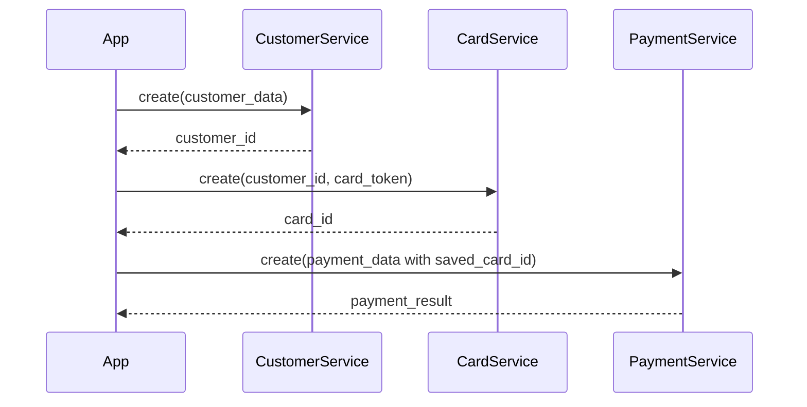
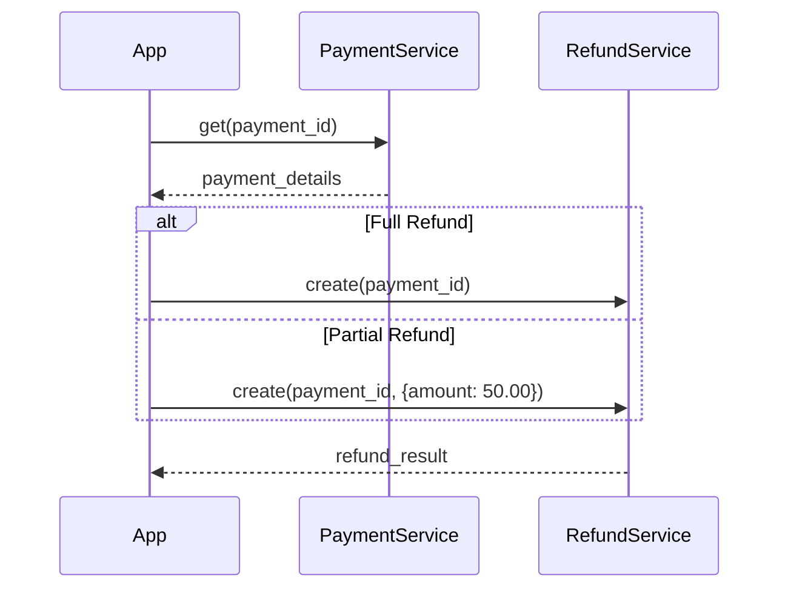

# Services Overview

Laravel MercadoPago provides eight dedicated service classes, each handling a specific aspect of the Mercado Pago integration. All services are registered as singletons and can be injected via dependency injection.

## Service Architecture

All services follow a consistent pattern:

1. **Dependency on MercadoPagoClientFactory** - Services use the factory to obtain SDK clients
2. **SDK Abstraction** - Services wrap SDK client methods with clean Laravel-friendly interfaces
3. **Type Safety** - Accept and return properly typed data structures
4. **Version Compatibility** - Handle SDK version differences transparently

<Note>
All services are automatically registered in the service container. You can inject them into your controllers, jobs, or other services without manual configuration.
</Note>

## Core Services

### PreferenceService

**Purpose**: Create payment preferences for Mercado Pago checkout flows

**Location**: `src/Services/PreferenceService.php:9`

**Use Cases**:
- Creating checkout preferences for redirect-based payments
- Configuring payment installments and methods
- Setting up back URLs for payment completion

**Methods**:

```php
public function create(array $payload): mixed
```

Creates a new payment preference and returns the preference data including the `init_point` URL.

**Example**:

```php
use Fitodac\LaravelMercadoPago\Services\PreferenceService;

class CheckoutController extends Controller
{
    public function __construct(
        private PreferenceService $preferenceService
    ) {}

    public function createCheckout()
    {
        $preference = $this->preferenceService->create([
            'items' => [
                [
                    'title' => 'Premium Subscription',
                    'quantity' => 1,
                    'unit_price' => 99.99,
                    'currency_id' => 'ARS'
                ]
            ],
            'payer' => [
                'email' => 'customer@example.com'
            ],
            'back_urls' => [
                'success' => route('payment.success'),
                'failure' => route('payment.failure'),
                'pending' => route('payment.pending')
            ],
            'auto_return' => 'approved'
        ]);

        return redirect($preference->init_point);
    }
}
```

<Accordion title="Understanding Preferences">
Preferences are Mercado Pago's way of configuring a checkout session. They define:

- What items are being purchased
- Who is making the purchase (payer information)
- Payment methods allowed
- URLs to redirect after payment
- Additional settings like installments, shipping, etc.

Once created, the preference returns an `init_point` URL where you redirect your customer to complete the payment.
</Accordion>

### PaymentService

**Purpose**: Process direct payments and retrieve payment information

**Location**: `src/Services/PaymentService.php:9`

**Use Cases**:
- Processing direct credit card payments
- Retrieving payment status and details
- Handling transparent checkout flows

**Methods**:

```php
// Create a new payment
public function create(array $payload): mixed

// Retrieve payment details
public function get(string $paymentId): mixed
```

**Example - Create Payment**:

```php
use Fitodac\LaravelMercadoPago\Services\PaymentService;

class PaymentController extends Controller
{
    public function __construct(
        private PaymentService $paymentService
    ) {}

    public function process(Request $request)
    {
        $payment = $this->paymentService->create([
            'transaction_amount' => 150.00,
            'token' => $request->input('token'), // From Mercado Pago SDK.js
            'description' => 'Product purchase',
            'installments' => 1,
            'payment_method_id' => 'visa',
            'payer' => [
                'email' => $request->input('email')
            ]
        ]);

        return response()->json([
            'status' => $payment->status,
            'id' => $payment->id
        ]);
    }
}
```

**Example - Get Payment**:

```php
public function show(string $paymentId)
{
    $payment = $this->paymentService->get($paymentId);

    return response()->json([
        'status' => $payment->status,
        'status_detail' => $payment->status_detail,
        'amount' => $payment->transaction_amount,
        'captured' => $payment->captured
    ]);
}
```

### CustomerService

**Purpose**: Manage customer records in Mercado Pago

**Location**: `src/Services/CustomerService.php:9`

**Use Cases**:
- Creating customer profiles for card storage
- Retrieving customer information
- Enabling one-click payments

**Methods**:

```php
// Create a new customer
public function create(array $payload): mixed

// Get customer details
public function get(string $customerId): mixed
```

**Example**:

```php
use Fitodac\LaravelMercadoPago\Services\CustomerService;

class CustomerController extends Controller
{
    public function __construct(
        private CustomerService $customerService
    ) {}

    public function createCustomer(Request $request)
    {
        $customer = $this->customerService->create([
            'email' => $request->input('email'),
            'first_name' => $request->input('first_name'),
            'last_name' => $request->input('last_name'),
            'phone' => [
                'area_code' => '11',
                'number' => '1234-5678'
            ],
            'identification' => [
                'type' => 'DNI',
                'number' => '12345678'
            ],
            'description' => 'Customer for ' . $request->input('email')
        ]);

        // Store customer ID for future use
        auth()->user()->update([
            'mercadopago_customer_id' => $customer->id
        ]);

        return response()->json(['customer_id' => $customer->id]);
    }
}
```

<Tip>
Always create a customer before saving cards. Cards must be associated with a customer ID.
</Tip>

### CardService

**Purpose**: Manage saved payment cards for customers

**Location**: `src/Services/CardService.php:9`

**Use Cases**:
- Saving customer payment cards for future use
- Deleting stored cards
- Enabling subscription or recurring payments

**Methods**:

```php
// Save a card to a customer
public function create(string $customerId, array $payload): mixed

// Delete a saved card
public function delete(string $customerId, string $cardId): mixed
```

**Example - Save Card**:

```php
use Fitodac\LaravelMercadoPago\Services\CardService;

class CardController extends Controller
{
    public function __construct(
        private CardService $cardService
    ) {}

    public function store(Request $request)
    {
        $customerId = auth()->user()->mercadopago_customer_id;

        $card = $this->cardService->create($customerId, [
            'token' => $request->input('token') // From SDK.js
        ]);

        // Store card reference
        auth()->user()->paymentCards()->create([
            'mercadopago_card_id' => $card->id,
            'last_four' => $card->last_four_digits,
            'brand' => $card->payment_method->name
        ]);

        return response()->json(['card_id' => $card->id]);
    }
}
```

**Example - Delete Card**:

```php
public function destroy(string $cardId)
{
    $customerId = auth()->user()->mercadopago_customer_id;

    $this->cardService->delete($customerId, $cardId);

    auth()->user()->paymentCards()
        ->where('mercadopago_card_id', $cardId)
        ->delete();

    return response()->json(['message' => 'Card deleted']);
}
```

### RefundService

**Purpose**: Process full and partial refunds for completed payments

**Location**: `src/Services/RefundService.php:9`

**Use Cases**:
- Issuing full refunds
- Processing partial refunds
- Handling order cancellations

**Methods**:

```php
public function create(string $paymentId, array $payload = []): mixed
```

The service automatically determines whether to issue a full or partial refund based on the presence of an `amount` key in the payload.

**Example - Full Refund**:

```php
use Fitodac\LaravelMercadoPago\Services\RefundService;

class RefundController extends Controller
{
    public function __construct(
        private RefundService $refundService
    ) {}

    public function refundFull(string $paymentId)
    {
        $refund = $this->refundService->create($paymentId);

        return response()->json([
            'refund_id' => $refund->id,
            'status' => $refund->status
        ]);
    }
}
```

**Example - Partial Refund**:

```php
public function refundPartial(Request $request, string $paymentId)
{
    $refund = $this->refundService->create($paymentId, [
        'amount' => $request->input('amount') // Partial amount
    ]);

    return response()->json([
        'refund_id' => $refund->id,
        'amount' => $refund->amount,
        'status' => $refund->status
    ]);
}
```

<Warning>
Refunds can only be issued on payments with status `approved`. Attempting to refund pending or rejected payments will result in an error.
</Warning>

### PaymentMethodService

**Purpose**: Retrieve available payment methods for the configured country

**Location**: `src/Services/PaymentMethodService.php:9`

**Use Cases**:
- Displaying available payment methods to customers
- Filtering payment options based on business logic
- Building custom checkout interfaces

**Methods**:

```php
public function all(): mixed
```

Returns all payment methods available for your Mercado Pago account.

**Example**:

```php
use Fitodac\LaravelMercadoPago\Services\PaymentMethodService;

class PaymentMethodController extends Controller
{
    public function __construct(
        private PaymentMethodService $paymentMethodService
    ) {}

    public function index()
    {
        $methods = $this->paymentMethodService->all();

        // Filter for credit cards only
        $creditCards = array_filter($methods, function($method) {
            return $method->payment_type_id === 'credit_card';
        });

        return response()->json(['payment_methods' => $creditCards]);
    }
}
```

**Response includes**:
- Payment method ID (e.g., `visa`, `mastercard`)
- Payment type (credit_card, debit_card, ticket, etc.)
- Thumbnail image URLs
- Min/max installments
- Processing modes

### WebhookService

**Purpose**: Handle and validate incoming Mercado Pago webhooks

**Location**: `src/Services/WebhookService.php:13`

**Use Cases**:
- Receiving payment status updates
- Validating webhook authenticity via HMAC signatures
- Processing asynchronous payment notifications

**Methods**:

```php
public function handle(Request $request): array
```

Validates the webhook signature (if `webhook_secret` is configured) and returns structured webhook data.

**Example**:

```php
use Fitodac\LaravelMercadoPago\Services\WebhookService;
use Fitodac\LaravelMercadoPago\Exceptions\InvalidWebhookSignatureException;

class WebhookController extends Controller
{
    public function __construct(
        private WebhookService $webhookService
    ) {}

    public function handle(Request $request)
    {
        try {
            $webhook = $this->webhookService->handle($request);

            // Check if signature was validated
            if ($webhook['validated']) {
                \Log::info('Webhook signature validated');
            }

            // Process based on topic
            match($webhook['topic']) {
                'payment' => $this->handlePayment($webhook['resource']),
                'merchant_order' => $this->handleMerchantOrder($webhook['resource']),
                default => \Log::info('Unknown webhook topic', $webhook)
            };

            return response()->json(['acknowledged' => true]);

        } catch (InvalidWebhookSignatureException $e) {
            \Log::error('Invalid webhook signature', [
                'error' => $e->getMessage()
            ]);
            
            return response()->json(['error' => 'Invalid signature'], 401);
        }
    }

    private function handlePayment(string $paymentId)
    {
        // Update order status based on payment
        $payment = app(PaymentService::class)->get($paymentId);
        
        \Log::info('Payment webhook received', [
            'payment_id' => $paymentId,
            'status' => $payment->status
        ]);
    }
}
```

**Returned Data Structure**:

```php
[
    'acknowledged' => true,
    'validated' => true, // true if signature was checked and valid
    'topic' => 'payment', // or 'merchant_order', 'subscription', etc.
    'resource' => '123456789', // Resource ID (payment ID, order ID, etc.)
    'payload' => [...] // Full webhook payload
]
```

<Accordion title="Webhook Signature Validation">
The WebhookService validates signatures using HMAC-SHA256 when `webhook_secret` is configured.

**Validation Process** (`src/Services/WebhookService.php:38`):

1. Parse the `x-signature` header
2. Extract timestamp (`ts`) and hash (`v1`)
3. Build a manifest: `id:{resource};request-id:{request_id};ts:{timestamp};`
4. Compute HMAC-SHA256 hash of manifest with webhook secret
5. Compare computed hash with provided `v1` hash
6. Throw `InvalidWebhookSignatureException` if mismatch

This ensures webhooks genuinely come from Mercado Pago and haven't been tampered with.
</Accordion>

### TestUserService

**Purpose**: Create test users for development and QA automation

**Location**: `src/Services/TestUserService.php:9`

**Use Cases**:
- Generating test users for sandbox testing
- Automating QA workflows
- Creating buyer and seller test accounts

**Methods**:

```php
public function create(array $payload): mixed
```

**Example**:

```php
use Fitodac\LaravelMercadoPago\Services\TestUserService;

class TestUserController extends Controller
{
    public function __construct(
        private TestUserService $testUserService
    ) {}

    public function createTestUser()
    {
        $testUser = $this->testUserService->create([
            'site_id' => 'MLA' // Argentina
        ]);

        return response()->json([
            'id' => $testUser['id'],
            'nickname' => $testUser['nickname'],
            'email' => $testUser['email'],
            'password' => $testUser['password']
        ]);
    }
}
```

<Note>
TestUserService uses `SdkHttpClient` to make direct API calls (`src/Services/TestUserService.php:17`) since the test user endpoint isn't wrapped by the standard SDK client classes.
</Note>

## Service Relationships

Here's how services commonly work together:

### Checkout Flow with Saved Cards



### Refund Flow



## Common Patterns

### Method Injection

Inject services directly into controller methods:

```php
public function process(Request $request, PaymentService $paymentService)
{
    return $paymentService->create($request->all());
}
```

### Constructor Injection

Inject multiple services via constructor:

```php
class CheckoutService
{
    public function __construct(
        private PreferenceService $preferenceService,
        private PaymentService $paymentService,
        private WebhookService $webhookService
    ) {}
}
```

### Service Resolution

Resolve services dynamically when needed:

```php
$paymentService = app(PaymentService::class);
$payment = $paymentService->get($paymentId);
```

## Error Handling

All services may throw exceptions from the Mercado Pago SDK or package-specific exceptions:

```php
use Fitodac\LaravelMercadoPago\Exceptions\MercadoPagoConfigurationException;
use MercadoPago\Exceptions\MPApiException;

try {
    $payment = $paymentService->create($data);
} catch (MercadoPagoConfigurationException $e) {
    // Configuration issue (missing credentials, SDK not installed)
    \Log::error('Configuration error: ' . $e->getMessage());
    return response()->json(['error' => 'Service misconfigured'], 500);
} catch (MPApiException $e) {
    // API error from Mercado Pago
    \Log::error('API error: ' . $e->getMessage());
    return response()->json(['error' => $e->getMessage()], 400);
}
```

## Next Steps

<CardGroup cols={2}>
  <Card title="Architecture" icon="diagram-project" href="/concepts/architecture">
    Understand the package architecture and design
  </Card>
  <Card title="Credentials" icon="key" href="/concepts/credentials">
    Learn about credential management
  </Card>
  <Card title="Creating Preferences" icon="file-invoice" href="/guides/creating-preferences">
    Build your first checkout flow
  </Card>
  <Card title="Handling Webhooks" icon="webhook" href="/guides/handling-webhooks">
    Process payment notifications
  </Card>
</CardGroup>
